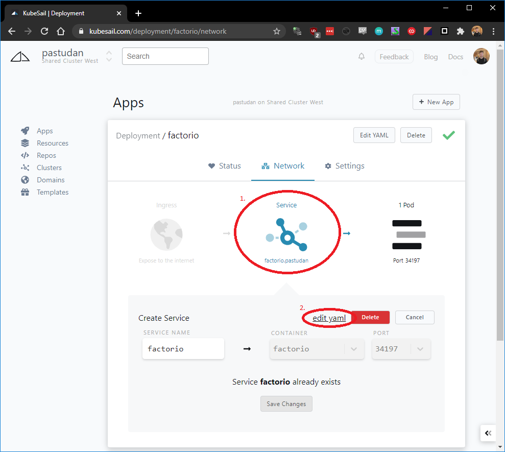
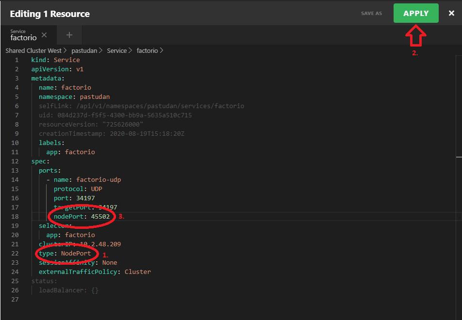

# Exposing TCP Services

While the KubeSail UI Helps you easily expose HTTP services, exposing TCP services using Kubesail is currently more manual and requires using the `kubectl` CLI tool. This page will guide you through the process.

> NOTE To prevent abuse, exposing TCP traffic on a shared cluster is only available to users of paid KubeSail plans

## Creating your service

You will need to create a `NodePort` Service pointed to your application. The easiest way to do this is to click the "Expose Inside Cluster" button on the "Network" tab of your app. After clicking "Save", click the "edit yaml" link.

In the editor on the right, we will want to change to the `type` to `NodePort` and click the **Apply** at the top right.
The editor will load in the the updated resource's YAML from Kubernetes. Note the port number under `spec` -> `ports` -> `nodePort`. That will be used in conjuction with the hostname `ext-a.kubesail.io` to access your application.

For example, if my Service contained `nodePort: 45502`, then I would access my service at `ext-a.kubesail.io:45502`

